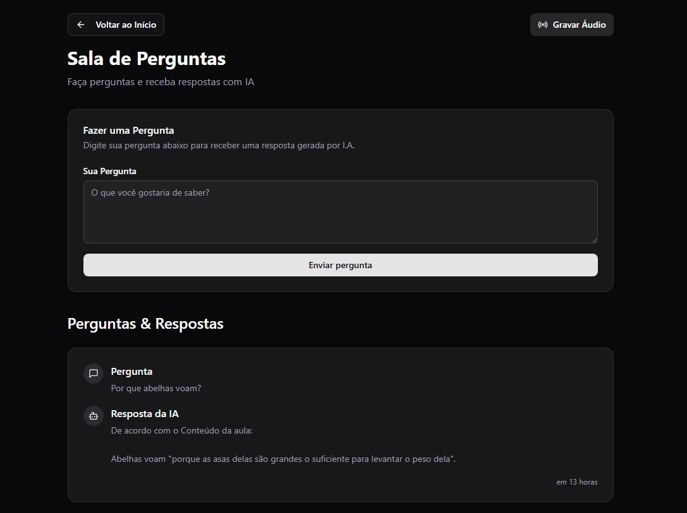

# NLW Agents - Web
Uma aplicação desenvolvida durante o evento Next Level Week Agents, com a criação de uma interface dinâmica e responsiva.




## Tecnologias
- **React**
- **Vite**
- **Typescript**
- **Tailwind CSS**
- **Shadcn UI**
- **Zod**
- **Biome**

## Como usar

### Requisitos

- [Node.js](https://nodejs.org/en)

### Clonar o repositorio

```bash
git clone https://github.com/victorhtomaz/let-me-ask-nlw.git let-me-ask

cd ./let-me-ask/web
```

### Instalar dependências 

```bash
npm install
```

### Executar aplicação

```bash
npm run dev
```

### Funcionalidades

* Visualizar salas
* Criar novas salas
* Fazer uma pergunta em uma sala
* Gravar áudio que responderá as perguntas feitas na sala